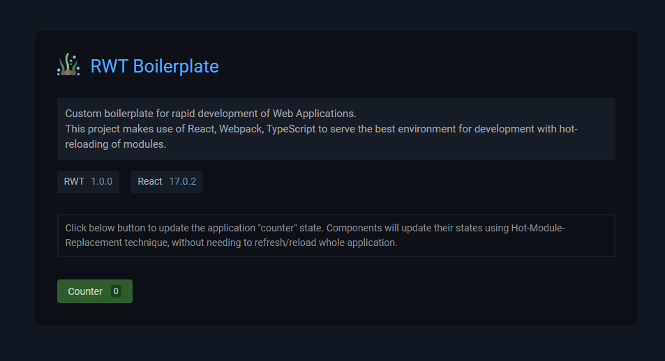

# React Webpack Typescript - Boilerplate (2021)

Minimal boilerplate for writing Web Applications using React, Webpack & TypeScript. This project makes use of latest packages like `react`, `typescript` & `webpack` to serve the best environment for development.

## Screenshot



<br>

## Core Features

- ⚛️ React
- 🌀 TypeScript
- 🛶 LESS Loader
- 🎨 CSS Loader
- 📸 Image Loader
- 🆎 Font Loader
- 🧹 ESLint
- 🔱 Webpack & Configuration
- 🧩 Aliases for project paths
- 🔥 Hot Module Replacement (Live Reload)

<br />

## Installation

#### To install this boilerplate you need to run following commands

Clone the repository on your hard drive :

```bash
git clone https://github.com/codesbiome/react-webpack-typescript-2021

cd react-webpack-typescript-2021
```

Install dependencies using Yarn or NPM :

```bash
yarn install
```

<br />

## Start : Development

To develop and run your web application, you need to run following command :

```bash
yarn start
```

<br />

## Lint : Development

To lint application source code using ESLint via this command :

```bash
yarn lint
```

<br />

## Build : Production

Distribution files output will be generated in `dist/` directory by default.

To build the production ready files for distribution, use the following command :

```bash
yarn build
```

<br />

## Webpack Configurations

To make it easier for managing environment based webpack configurations, we using separated `development` and `production` configuration files, they are available in :

```bash
tools/webpack/webpack.config.dev.js
tools/webpack/webpack.config.prod.js
```

For further information, you can visit [Webpack Configuration](https://webpack.js.org/configuration/)